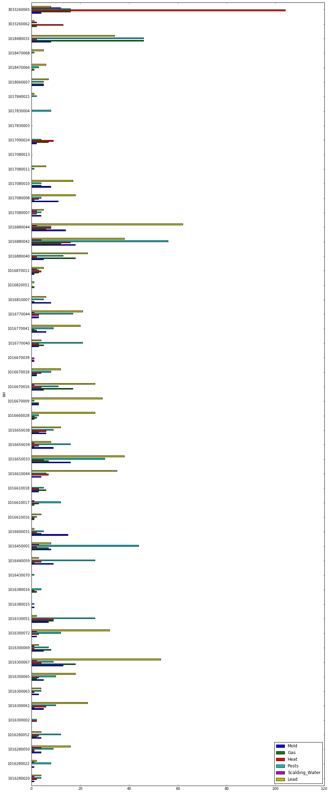

```python
import matplotlib
import pandas as pd
import re
%matplotlib inline
import matplotlib.pyplot as plt

#Read in the csv. Throw out bad lines-- therer are just a few-- and suppress warnings.
filepath = "/Users/GeorgiaKromrei/Desktop/Personal_Drive/S18_Dataviz/East_Harlem_housing_analysis/emerald_equity_hpd_violations.csv"
df = pd.read_csv(filepath, error_bad_lines=False, warn_bad_lines=False)
#Wrap text, I want to see those commplaints in their entirety
pd.set_option('display.max_colwidth', -1)
```


```python
#These are the things I want to pay attention to
df['Mold'] = df['novdescription'].str.contains('MOLD').astype(int)
df['Gas'] = df['novdescription'].str.contains('GAS').astype(int)
#df['Floors'] = df['novdescription'].str.contains('FLOOR').astype(int)
df['Heat'] = df['novdescription'].str.contains('HEAT').astype(int)
#df['Smoke'] = df['novdescription'].str.contains('SMOKE DETECTOR').astype(int)
df['Pests'] = df['novdescription'].str.contains('PEST|RODENT|ROACH|MICE').astype(int)
df['Scalding_Water'] = df['novdescription'].str.contains('SCALDING').astype(int)
df['Lead'] = df['novdescription'].str.contains('LEAD').astype(int)
#df['Paint'] = df['novdescription'].str.contains('PEELING PAINT').astype(int)

#set index as bbl
df.set_index('bbl', inplace=True)
```


```python
#Now that I have s
df = df.groupby(df.index).sum()
```


```python
df
```


<div>
<style>
    .dataframe thead tr:only-child th {
        text-align: right;
    }

    .dataframe thead th {
        text-align: left;
    }

    .dataframe tbody tr th {
        vertical-align: top;
    }
</style>
<table border="1" class="dataframe">
  <thead>
    <tr style="text-align: right;">
      <th></th>
      <th>Mold</th>
      <th>Gas</th>
      <th>Heat</th>
      <th>Pests</th>
      <th>Scalding_Water</th>
      <th>Lead</th>
    </tr>
    <tr>
      <th>bbl</th>
      <th></th>
      <th></th>
      <th></th>
      <th></th>
      <th></th>
      <th></th>
    </tr>
  </thead>
  <tbody>
    <tr>
      <th>1016280020</th>
      <td>1</td>
      <td>0</td>
      <td>2</td>
      <td>4</td>
      <td>1</td>
      <td>4</td>
    </tr>
    <tr>
      <th>1016280022</th>
      <td>1</td>
      <td>0</td>
      <td>0</td>
      <td>8</td>
      <td>1</td>
      <td>2</td>
    </tr>
    <tr>
      <th>1016280050</th>
      <td>4</td>
      <td>1</td>
      <td>1</td>
      <td>9</td>
      <td>4</td>
      <td>16</td>
    </tr>
    <tr>
      <th>1016280052</th>
      <td>4</td>
      <td>2</td>
      <td>3</td>
      <td>12</td>
      <td>0</td>
      <td>4</td>
    </tr>
    <tr>
      <th>1016300002</th>
      <td>0</td>
      <td>0</td>
      <td>2</td>
      <td>2</td>
      <td>0</td>
      <td>0</td>
    </tr>
    <tr>
      <th>1016300061</th>
      <td>5</td>
      <td>1</td>
      <td>6</td>
      <td>10</td>
      <td>0</td>
      <td>23</td>
    </tr>
    <tr>
      <th>1016300063</th>
      <td>3</td>
      <td>0</td>
      <td>1</td>
      <td>4</td>
      <td>0</td>
      <td>4</td>
    </tr>
    <tr>
      <th>1016300065</th>
      <td>5</td>
      <td>2</td>
      <td>3</td>
      <td>10</td>
      <td>0</td>
      <td>18</td>
    </tr>
    <tr>
      <th>1016300067</th>
      <td>13</td>
      <td>18</td>
      <td>4</td>
      <td>9</td>
      <td>2</td>
      <td>53</td>
    </tr>
    <tr>
      <th>1016300069</th>
      <td>5</td>
      <td>8</td>
      <td>1</td>
      <td>7</td>
      <td>1</td>
      <td>3</td>
    </tr>
    <tr>
      <th>1016300072</th>
      <td>2</td>
      <td>0</td>
      <td>3</td>
      <td>12</td>
      <td>2</td>
      <td>32</td>
    </tr>
    <tr>
      <th>1016330051</th>
      <td>7</td>
      <td>9</td>
      <td>9</td>
      <td>26</td>
      <td>0</td>
      <td>2</td>
    </tr>
    <tr>
      <th>1016380015</th>
      <td>1</td>
      <td>0</td>
      <td>0</td>
      <td>1</td>
      <td>0</td>
      <td>0</td>
    </tr>
    <tr>
      <th>1016380016</th>
      <td>0</td>
      <td>2</td>
      <td>1</td>
      <td>4</td>
      <td>0</td>
      <td>0</td>
    </tr>
    <tr>
      <th>1016430070</th>
      <td>0</td>
      <td>0</td>
      <td>0</td>
      <td>1</td>
      <td>0</td>
      <td>0</td>
    </tr>
    <tr>
      <th>1016440059</th>
      <td>9</td>
      <td>1</td>
      <td>4</td>
      <td>26</td>
      <td>0</td>
      <td>3</td>
    </tr>
    <tr>
      <th>1016450001</th>
      <td>8</td>
      <td>7</td>
      <td>2</td>
      <td>44</td>
      <td>3</td>
      <td>8</td>
    </tr>
    <tr>
      <th>1016600031</th>
      <td>15</td>
      <td>4</td>
      <td>2</td>
      <td>5</td>
      <td>0</td>
      <td>1</td>
    </tr>
    <tr>
      <th>1016610016</th>
      <td>0</td>
      <td>1</td>
      <td>1</td>
      <td>2</td>
      <td>0</td>
      <td>4</td>
    </tr>
    <tr>
      <th>1016610017</th>
      <td>0</td>
      <td>1</td>
      <td>3</td>
      <td>12</td>
      <td>1</td>
      <td>0</td>
    </tr>
    <tr>
      <th>1016610018</th>
      <td>3</td>
      <td>6</td>
      <td>3</td>
      <td>5</td>
      <td>0</td>
      <td>0</td>
    </tr>
    <tr>
      <th>1016610044</th>
      <td>4</td>
      <td>0</td>
      <td>7</td>
      <td>6</td>
      <td>0</td>
      <td>35</td>
    </tr>
    <tr>
      <th>1016650033</th>
      <td>16</td>
      <td>7</td>
      <td>5</td>
      <td>30</td>
      <td>0</td>
      <td>38</td>
    </tr>
    <tr>
      <th>1016650034</th>
      <td>9</td>
      <td>1</td>
      <td>3</td>
      <td>16</td>
      <td>1</td>
      <td>8</td>
    </tr>
    <tr>
      <th>1016650038</th>
      <td>6</td>
      <td>3</td>
      <td>6</td>
      <td>9</td>
      <td>0</td>
      <td>12</td>
    </tr>
    <tr>
      <th>1016660028</th>
      <td>1</td>
      <td>2</td>
      <td>1</td>
      <td>3</td>
      <td>0</td>
      <td>26</td>
    </tr>
    <tr>
      <th>1016670009</th>
      <td>3</td>
      <td>3</td>
      <td>0</td>
      <td>1</td>
      <td>0</td>
      <td>29</td>
    </tr>
    <tr>
      <th>1016670016</th>
      <td>5</td>
      <td>17</td>
      <td>4</td>
      <td>11</td>
      <td>1</td>
      <td>26</td>
    </tr>
    <tr>
      <th>1016670018</th>
      <td>2</td>
      <td>2</td>
      <td>4</td>
      <td>8</td>
      <td>0</td>
      <td>12</td>
    </tr>
    <tr>
      <th>1016670039</th>
      <td>1</td>
      <td>0</td>
      <td>1</td>
      <td>0</td>
      <td>0</td>
      <td>0</td>
    </tr>
    <tr>
      <th>1016770040</th>
      <td>3</td>
      <td>5</td>
      <td>3</td>
      <td>21</td>
      <td>0</td>
      <td>4</td>
    </tr>
    <tr>
      <th>1016770041</th>
      <td>6</td>
      <td>2</td>
      <td>1</td>
      <td>9</td>
      <td>0</td>
      <td>20</td>
    </tr>
    <tr>
      <th>1016770044</th>
      <td>3</td>
      <td>0</td>
      <td>3</td>
      <td>17</td>
      <td>1</td>
      <td>21</td>
    </tr>
    <tr>
      <th>1016810007</th>
      <td>8</td>
      <td>1</td>
      <td>0</td>
      <td>5</td>
      <td>0</td>
      <td>6</td>
    </tr>
    <tr>
      <th>1016820051</th>
      <td>0</td>
      <td>1</td>
      <td>0</td>
      <td>0</td>
      <td>0</td>
      <td>1</td>
    </tr>
    <tr>
      <th>1016870011</th>
      <td>1</td>
      <td>3</td>
      <td>4</td>
      <td>3</td>
      <td>2</td>
      <td>5</td>
    </tr>
    <tr>
      <th>1016880040</th>
      <td>5</td>
      <td>18</td>
      <td>2</td>
      <td>13</td>
      <td>0</td>
      <td>23</td>
    </tr>
    <tr>
      <th>1016880042</th>
      <td>18</td>
      <td>12</td>
      <td>16</td>
      <td>56</td>
      <td>4</td>
      <td>38</td>
    </tr>
    <tr>
      <th>1016880044</th>
      <td>14</td>
      <td>6</td>
      <td>8</td>
      <td>8</td>
      <td>2</td>
      <td>62</td>
    </tr>
    <tr>
      <th>1017080007</th>
      <td>4</td>
      <td>0</td>
      <td>2</td>
      <td>4</td>
      <td>2</td>
      <td>5</td>
    </tr>
    <tr>
      <th>1017080008</th>
      <td>11</td>
      <td>1</td>
      <td>3</td>
      <td>4</td>
      <td>0</td>
      <td>18</td>
    </tr>
    <tr>
      <th>1017080010</th>
      <td>8</td>
      <td>4</td>
      <td>0</td>
      <td>4</td>
      <td>0</td>
      <td>17</td>
    </tr>
    <tr>
      <th>1017080011</th>
      <td>0</td>
      <td>0</td>
      <td>0</td>
      <td>1</td>
      <td>0</td>
      <td>6</td>
    </tr>
    <tr>
      <th>1017080013</th>
      <td>0</td>
      <td>0</td>
      <td>0</td>
      <td>0</td>
      <td>0</td>
      <td>0</td>
    </tr>
    <tr>
      <th>1017090024</th>
      <td>2</td>
      <td>7</td>
      <td>9</td>
      <td>4</td>
      <td>0</td>
      <td>0</td>
    </tr>
    <tr>
      <th>1017830003</th>
      <td>0</td>
      <td>0</td>
      <td>0</td>
      <td>0</td>
      <td>0</td>
      <td>0</td>
    </tr>
    <tr>
      <th>1017830004</th>
      <td>0</td>
      <td>0</td>
      <td>0</td>
      <td>8</td>
      <td>0</td>
      <td>0</td>
    </tr>
    <tr>
      <th>1017840021</th>
      <td>0</td>
      <td>0</td>
      <td>0</td>
      <td>2</td>
      <td>0</td>
      <td>1</td>
    </tr>
    <tr>
      <th>1018060007</th>
      <td>5</td>
      <td>5</td>
      <td>0</td>
      <td>5</td>
      <td>0</td>
      <td>7</td>
    </tr>
    <tr>
      <th>1018470066</th>
      <td>0</td>
      <td>1</td>
      <td>0</td>
      <td>3</td>
      <td>0</td>
      <td>6</td>
    </tr>
    <tr>
      <th>1018470068</th>
      <td>0</td>
      <td>0</td>
      <td>0</td>
      <td>1</td>
      <td>0</td>
      <td>5</td>
    </tr>
    <tr>
      <th>1018480031</th>
      <td>8</td>
      <td>46</td>
      <td>2</td>
      <td>46</td>
      <td>0</td>
      <td>34</td>
    </tr>
    <tr>
      <th>3033260062</th>
      <td>0</td>
      <td>2</td>
      <td>13</td>
      <td>0</td>
      <td>2</td>
      <td>1</td>
    </tr>
    <tr>
      <th>3033260065</th>
      <td>4</td>
      <td>16</td>
      <td>104</td>
      <td>16</td>
      <td>12</td>
      <td>8</td>
    </tr>
  </tbody>
</table>
</div>


```python
df.plot(kind='barh', figsize=(15, 40))
plt.savefig('hpd-complaints.png')
```





```python

```

    ['Mold', 'Gas', 'Floors', 'Heat', 'Smoke', 'Pests', 'Scalding_Water', 'Lead', 'Paint', 'Leak']


```python

```
